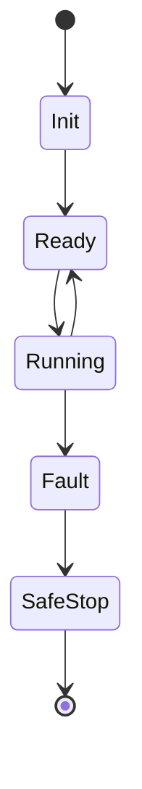

# Templates (Markdown)

## docs/index.md
# <Repo Name>

## What this repo does
<one paragraph>

## Quickstart
- Install:
- Run:
- Test:

## Profiles
See docs/_profiles.md

## Architecture
- docs/architecture/overview.md
- docs/architecture/module-deps.md
- docs/architecture/dataflow.md

## Workflows
- docs/workflows/entrypoints.md
- docs/workflows/typical-runs.md

## Glossary and artifacts
- docs/glossary/data-types-and-symbols.md
- docs/glossary/artifacts.md
- docs/conventions/units-and-frames.md

---

## docs/_manifest.yml
generated_at: "<ISO-8601>"
repo_revision: "<commit or version>"
profiles:
  - "<profile>"
scope:
  included:
    - "<paths/modules>"
  excluded:
    - "<paths/modules>"
diagrams:
  - module_deps
  - dataflow
  - lifecycle
unknowns:
  inferred_symbols:
    - "<symbol>: <meaning> (inferred from ...)"
notes:
  - "<anything important>"

---

## Module template: docs/modules/<module>.md
# Module: <module>

## Purpose
## Dependencies
- Imports:
- Called by:

## Public surfaces
- Public classes:
- Public functions:
- CLI/tools:

## Workflows inside this module (optional)

## Inheritance

Base	Derived 	Notes


## API conventions and contracts
- Inputs:
- Outputs:
- Errors:
- Statefulness:

```html
<insert standardized contract notes>
```
> [!IMPORTANT]
> Intentionally-unused parameter: <name> kept for signature compatibility across <interface>.

## Failure modes and safeguards
- ...

---


## Class template: docs/classes/.md

# Class: <ClassName>

## Responsibility

## Contract 
- key state
- lifecycle
- thread safety
- external resources

## Key state

Field	Type	Meaning Invariants


## Methods/kernels

Name	Purpose	Side effects 	Notes

## Lifecycle


## Usage

```python
# minimal example
```

---

## Function/kernel template: docs/functions/.md

# Function/Kernel: <name>

## Purpose

## Contract

Name Type Shape Units Device Meaning

## Math / physics

Governing equations:

$$
…
$$

## Algorithm

```text
1. ...
2. ...
```

## Numerical safeguards and stability

## Complexity and memory

## Failure modes 

---

