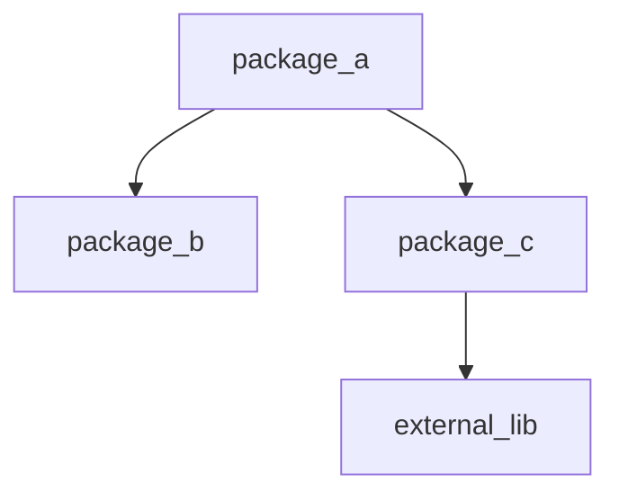
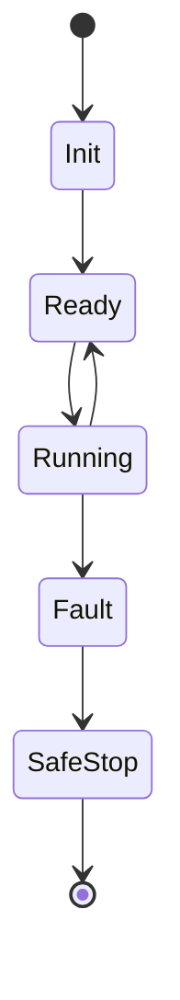
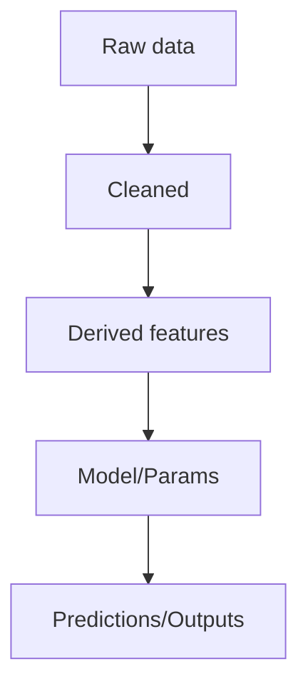
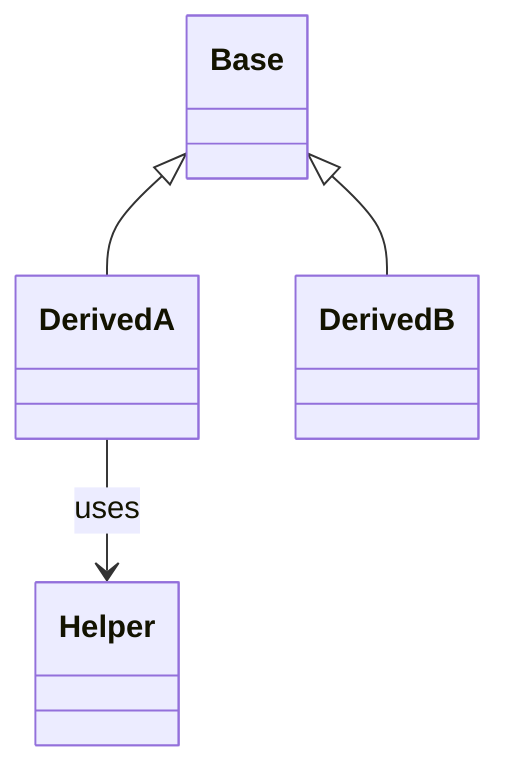
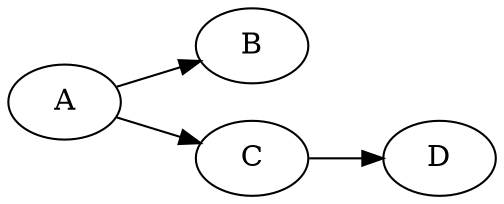

# Diagram recipes

## Module dependency (Mermaid)

## Dataflow diagram (Mermaid)

## Lifecycle / state machine (Mermaid)

## Data provenance graph (Mermaid)

## Class relationships (Mermaid)

## Graphviz DOT (when Mermaid gets messy)

### LaTeX/TikZ note

Prefer TikZ for small diagrams. For large dependency graphs:
- Generate DOT → PDF, then include with \includegraphics.

